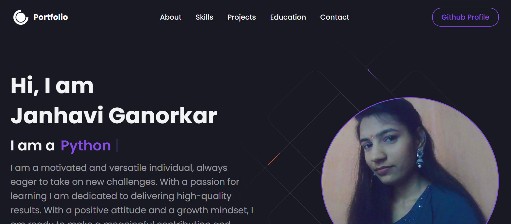

## my_protfolio_website
# ✨ Features
- **Responsive Design**: Adapts to all screen sizes for mobile, tablet, and desktop users.
- **Material-UI Integration**: Ensures a sleek and professional appearance using pre-built components.
**Custom Styling**: Styled-components for creating reusable and dynamic styles.
**Smooth Transitions**: Interactive hover effects and animations for a better user experience.
**Customizable**: Easily update personal information, themes, and content.
# 🛠️ Tech Stack
React: JavaScript library for building user interfaces.
Material-UI (MUI): A UI framework with pre-designed React components.
Styled-Components: A powerful CSS-in-JS library for custom styling.
React Router (optional): Used for navigation between sections (if implemented).
# 🚀 Getting Started
1.Follow these steps to set up the project on your local machine:
```bash
git clone https://github.com/JanhaviGanorkar/my_protfolio_website  
cd portfolio  

```
2.Install Dependencies:

```bash

npm install
```  
3.Start the Development Server:

```bash

npm start  
```
4.Open your browser and navigate to http://localhost:3000.

# ✏️ Customization
5.Update Personal Information
Edit the respective components (e.g., About.js, Projects.js) to include your details, skills, and projects.

6.Change Theme
Customize the Material-UI theme in the ThemeProvider to match your branding:

```bash
import { createTheme, ThemeProvider } from '@mui/material/styles';

const theme = createTheme({
  palette: {
    primary: {
      main: '#123456', // Replace with your primary color
    },
    secondary: {
      main: '#654321', // Replace with your secondary color
    },
  },
});

```
## 🖥️ Deployment
7.Deploy to GitHub Pages
Install gh-pages:

```bash

npm install gh-pages 
``` 
Add these scripts to your package.json:

```bash
"homepage": "https://your-username.github.io/portfolio",
"scripts": {
  "predeploy": "npm run build",
  "deploy": "gh-pages -d build"
}
```
8.Deploy the portfolio:

```bash

npm run deploy  
```
Alternatively, you can use platforms like Netlify or Vercel for quick deployment.

## 📸 Screenshots



## 🤝 Contributing
Contributions are welcome! If you'd like to suggest changes or report issues, please open an issue or submit a pull request.

## 🙏 Acknowledgments
**React**: ["React documentation"](https://www.react.dev/)
**Material-UI**: ["Material-UI documentation"](https://mui.com/)
**Styled-Components**: ["Styled-Components documentation"](https://styled-components.com/)
# my_protfolio_website
# my_protfolio_website
